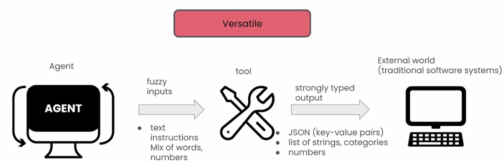

The Summary of Crewai course: Multi AI Agent Systems with crewAI 


# Crewai Note

## Multi AI Agent Systems with crewAI 

### Overview


#### Agentic Automation


### What are agent?

 The agent is boen when you get this LLM to engage in an inner thinking process throughout it asks questions and anwer the same questions itself to the point that it can move on and get better by itself

Task -> agent(Tools) -> Answer

Multi Agent:

So whenever you task an agent with something, this agent can also task another agent with another task. In the end you get one single final answer


### Foundations of Multi-Agent systems and CrewAI: Create agents to research and write an article

```python
from crewai import Agent,Task, Crew
```
#### Agent: Planner, Writer, Editor

**Note**: The benefit of using _multiple strings_ :
```Python
varname = "line 1 of text"
          "line 2 of text"
```

versus the _triple quote docstring_:
```Python
varname = """line 1 of text
             line 2 of text
          """
```
is that it can avoid adding those whitespaces and newline characters, making it better formatted to be passed to the LLM.
```python
planner = Agent(
    role="Content Planner",
    goal="Plan engaging and factually accurate content on {topic}",
    backstory="You're working on planning a blog article "
              "about the topic: {topic}."
              "You collect information that helps the "
              "audience learn something "
              "and make informed decisions. "
              "Your work is the basis for "
              "the Content Writer to write an article on this topic.",
    allow_delegation=False,
	verbose=True
)
```

```python
writer = Agent(
    role="Content Writer",
    goal="Write insightful and factually accurate "
         "opinion piece about the topic: {topic}",
    backstory="You're working on a writing "
              "a new opinion piece about the topic: {topic}. "
              "You base your writing on the work of "
              "the Content Planner, who provides an outline "
              "and relevant context about the topic. "
              "You follow the main objectives and "
              "direction of the outline, "
              "as provide by the Content Planner. "
              "You also provide objective and impartial insights "
              "and back them up with information "
              "provide by the Content Planner. "
              "You acknowledge in your opinion piece "
              "when your statements are opinions "
              "as opposed to objective statements.",
    allow_delegation=False,
    verbose=True
)
```

```python
editor = Agent(
    role="Editor",
    goal="Edit a given blog post to align with "
         "the writing style of the organization. ",
    backstory="You are an editor who receives a blog post "
              "from the Content Writer. "
              "Your goal is to review the blog post "
              "to ensure that it follows journalistic best practices,"
              "provides balanced viewpoints "
              "when providing opinions or assertions, "
              "and also avoids major controversial topics "
              "or opinions when possible.",
    allow_delegation=False,
    verbose=True
)
```

#### Tasks:  Plan, Write, Edit
>Define your Tasks, and provide them a `description`, `expected_output` and `agent`.

`description`: what do you expect the agent to do?
`expected_output`: Acts as a forcing function to force you to think exactly what you want to get out of the task, what you want this agent to produce as a final outcome.
`agent`: assign the agent to the task


```python
plan = Task(
    description=(
        "1. Prioritize the latest trends, key players, "
            "and noteworthy news on {topic}.\n"
        "2. Identify the target audience, considering "
            "their interests and pain points.\n"
        "3. Develop a detailed content outline including "
            "an introduction, key points, and a call to action.\n"
        "4. Include SEO keywords and relevant data or sources."
    ),
    expected_output="A comprehensive content plan document "
        "with an outline, audience analysis, "
        "SEO keywords, and resources.",
    agent=planner,
)
```

```python
write = Task(
    description=(
        "1. Use the content plan to craft a compelling "
            "blog post on {topic}.\n"
        "2. Incorporate SEO keywords naturally.\n"
		"3. Sections/Subtitles are properly named "
            "in an engaging manner.\n"
        "4. Ensure the post is structured with an "
            "engaging introduction, insightful body, "
            "and a summarizing conclusion.\n"
        "5. Proofread for grammatical errors and "
            "alignment with the brand's voice.\n"
    ),
    expected_output="A well-written blog post "
        "in markdown format, ready for publication, "
        "each section should have 2 or 3 paragraphs.",
    agent=writer,
)
```

```python
edit = Task(
    description=("Proofread the given blog post for "
                 "grammatical errors and "
                 "alignment with the brand's voice."),
    expected_output="A well-written blog post in markdown format, "
                    "ready for publication, "
                    "each section should have 2 or 3 paragraphs.",
    agent=editor
)
```


#### Creating the Crew: combine you agents and tasks

- Create your crew of Agents
- Pass the tasks to be performed by those agents.
    - **Note**: *For this simple example*, the tasks will be performed sequentially (i.e they are dependent on each other), so the _order_ of the task in the list _matters_.
- `verbose=2` allows you to see all the logs of the execution. 

```python
crew = Crew(
    agents=[planner, writer, editor],
    tasks=[plan, write, edit],
    verbose=2
)
```
`verbose`(equal 1 or 2) allows us to see how this crew is exrcuting and look at some of its logs

The task is operated i order, it's important given that the output of one task is going to be sent as part of the inpiut for the next?


#### how to run the crew

```python
result = crew.kickoff(inputs={"topic": "Artificial Intelligence"})

```
```python
from IPython.display import Markdown
Markdown(result)
```

### Key Elements of AI agents

#### Role Playing
Role playing can make a huge difference on the responses that you're going to get from agent.
The ability for them to kind of like just take the shape or form or function for something else will have a direct impact on what kind of answers you're going to get and kind of lik what are you going for.

Example:
Ask: Give me an analysis on the tesla stock

Ask: You are a FINRA approved financial analyst. give me an analysis on tesla stock

When building agent makesure you are setting the ==appropriate roles, the appropriate goals, and the appropriate backstories==, because that will paly a role in the kind of results that you are going to get.


#### Focus
Too much tools, too much information, or too much context, you models can lose imprtant information amd also open uo opportunities for more hallucination. 

Use different agents let them seperate the work
Choose the tools that you are going to give your agents. You want to make sure that you are providing them with the key tools to do the job they need.


#### Cooperation

The ability for these agents, they are now role playing to talk to each other and simulate that same chat behavior creates a better result.
They can basically **take feedback** from each other, they can **delegate tasks** to each other, and by doing that, produce a better outcome


#### Guardrails
AI applications imply fuzzy inputs, fuzzy transformations and fuzzy outputs. That means that you do not necessarily will get stong typed results.

Throught many iterations, crewai implemented a series of guardrails that prevents your agent from derailing and nudgr your agents to stay on track, and most of those are implemented on the framework level.

These guardrails are going yo make sure to prevent hallucinations and to also make sure that you get a reliable and consistnet result throughout your multi-agent systems.

#### Memory
Memory is the ability for your agent to remember what it has done, and not only that, but to use that to inform new decisions and new executions.
The ability to recollect what they did in the past, learn from it, and apply that knowledge into future execution.
In the crewai:
1. **Long-term memory**
    * Memory during execution of a task
    * Share knowledge,activites, and learnings with other agents
    * Share intermediate information even before prociding "task completion" output.
  
Short term memory is a memory that lives only during the crew execution. Every time that you run a crew ad you kick it off, it strats from the blank. This memory is useful because as different agents try to accomplish different tasks, they store different things that they learn in this memory. And this memory is shared across all the agents, meaning that an agent number 2 or 4 can tap into learnings form agent number 1.
So tthe short term memory is something that helps to share context during the crew execution, so that you get better outcomes.

2. **Short-term memory**
   * Memory stored after execution of curent tasks.
   * Long term memory can be used in any future tasks,
   * Lead "self-improving agents".
  
Long term memory is **stored in a database locally**, and that allows yuor angent to learn form previous exectuations. So every time that your agent completes a task, it **self-critiques** itself to learn what it could have done better, or what are the things that should be in there that are not.

3. **Entity memory**
   It is only during the excution, it stores what are subjects that are be discussing. So if your agent is trying to learn smething abut a specific company it maight store that company as an entity and its understanding of this company in this database as well.


### Code: Multi agent custimer support automation


In this lesson, you will learn about the six key elements which help make Agents perform even better:
- Role Playing
- Focus
- Tools
- Cooperation
- Guardrails
- Memory

The libraries are already installed in the classroom. If you're running this notebook on your own machine, you can install the following:
```Python
!pip install crewai==0.28.8 crewai_tools==0.1.6 langchain_community==0.0.29
```


```python
# Warning control
import warnings
warnings.filterwarnings('ignore')
```

- Import libraries, API and LLM


```python
from crewai import Agent, Task, Crew
```


```python
import os
from utils import get_openai_api_key

openai_api_key = get_openai_api_key()
os.environ["OPENAI_MODEL_NAME"] = 'gpt-3.5-turbo'
```

#### Role Playing, Focus and Cooperation


```python
support_agent = Agent(
    role="Senior Support Representative",
	goal="Be the most friendly and helpful "
        "support representative in your team",
	backstory=(
		"You work at crewAI (https://crewai.com) and "
        " are now working on providing "
		"support to {customer}, a super important customer "
        " for your company."
		"You need to make sure that you provide the best support!"
		"Make sure to provide full complete answers, "
        " and make no assumptions."
	),
	allow_delegation=False,
	verbose=True
)
```


- By not setting `allow_delegation=False`, `allow_delegation` takes its default value of being `True`.
- This means the agent _can_ delegate its work to another agent which is better suited to do a particular task. 


```python
support_quality_assurance_agent = Agent(
	role="Support Quality Assurance Specialist",
	goal="Get recognition for providing the "
    "best support quality assurance in your team",
	backstory=(
		"You work at crewAI (https://crewai.com) and "
        "are now working with your team "
		"on a request from {customer} ensuring that "
        "the support representative is "
		"providing the best support possible.\n"
		"You need to make sure that the support representative "
        "is providing full"
		"complete answers, and make no assumptions."
	),
	verbose=True
)
```

* **Role Playing**: Both agents have been given a role, goal and backstory.
* **Focus**: Both agents have been prompted to get into the character of the roles they are playing.
* **Cooperation**: Support Quality Assurance Agent can delegate work back to the Support Agent, allowing for these agents to work together.

#### Tools, Guardrails and Memory

##### Tools

- Import CrewAI tools


```python
from crewai_tools import SerperDevTool, \
                         ScrapeWebsiteTool, \
                         WebsiteSearchTool
```

##### Possible Custom Tools
- Load customer data
- Tap into previous conversations
- Load data from a CRM
- Checking existing bug reports
- Checking existing feature requests
- Checking ongoing tickets
- ... and more

- Some ways of using CrewAI tools.

```Python
search_tool = SerperDevTool()
scrape_tool = ScrapeWebsiteTool()
```

- Instantiate a document scraper tool.
- The tool will scrape a page (only 1 URL) of the CrewAI documentation.


```python
docs_scrape_tool = ScrapeWebsiteTool(
    website_url="https://docs.crewai.com/how-to/Creating-a-Crew-and-kick-it-off/"
)
```

###### Different Ways to Give Agents Tools

- Agent Level: The Agent can use the Tool(s) on any Task it performs.
- Task Level: The Agent will only use the Tool(s) when performing that specific Task.

**Note**: Task Tools override the Agent Tools.

##### Creating Tasks
- You are passing the Tool on the Task Level.


```python
inquiry_resolution = Task(
    description=(
        "{customer} just reached out with a super important ask:\n"
	    "{inquiry}\n\n"
        "{person} from {customer} is the one that reached out. "
		"Make sure to use everything you know "
        "to provide the best support possible."
		"You must strive to provide a complete "
        "and accurate response to the customer's inquiry."
    ),
    expected_output=(
	    "A detailed, informative response to the "
        "customer's inquiry that addresses "
        "all aspects of their question.\n"
        "The response should include references "
        "to everything you used to find the answer, "
        "including external data or solutions. "
        "Ensure the answer is complete, "
		"leaving no questions unanswered, and maintain a helpful and friendly "
		"tone throughout."
    ),
	tools=[docs_scrape_tool],
    agent=support_agent,
)
```

- `quality_assurance_review` is not using any Tool(s)
- Here the QA Agent will only review the work of the Support Agent


```python
quality_assurance_review = Task(
    description=(
        "Review the response drafted by the Senior Support Representative for {customer}'s inquiry. "
        "Ensure that the answer is comprehensive, accurate, and adheres to the "
		"high-quality standards expected for customer support.\n"
        "Verify that all parts of the customer's inquiry "
        "have been addressed "
		"thoroughly, with a helpful and friendly tone.\n"
        "Check for references and sources used to "
        " find the information, "
		"ensuring the response is well-supported and "
        "leaves no questions unanswered."
    ),
    expected_output=(
        "A final, detailed, and informative response "
        "ready to be sent to the customer.\n"
        "This response should fully address the "
        "customer's inquiry, incorporating all "
		"relevant feedback and improvements.\n"
		"Don't be too formal, we are a chill and cool company "
	    "but maintain a professional and friendly tone throughout."
    ),
    agent=support_quality_assurance_agent,
)

```

##### Creating the Crew

###### Memory
- Setting `memory=True` when putting the crew together enables Memory.


```python
crew = Crew(
  agents=[support_agent, support_quality_assurance_agent],
  tasks=[inquiry_resolution, quality_assurance_review],
  verbose=2,
  memory=True
)
```

##### Running the Crew

**Note**: LLMs can provide different outputs for they same input, so what you get might be different than what you see in the video.

###### Guardrails
- By running the execution below, you can see that the agents and the responses are within the scope of what we expect from them.


```python
inputs = {
    "customer": "DeepLearningAI",
    "person": "Andrew Ng",
    "inquiry": "I need help with setting up a Crew "
               "and kicking it off, specifically "
               "how can I add memory to my crew? "
               "Can you provide guidance?"
}
result = crew.kickoff(inputs=inputs)
```

- Display the final result as Markdown.


```python
from IPython.display import Markdown
Markdown(result)
```

### Mental Framework for agent creation
* Agen "self improve" using memory
* Guardrails prevents agents from going into "rabbit holes"(unproductive, repetitive loops)
* Agent always attempt to get to an answer(avoid iterating indefinitely)
* Foucs
  * narrowly defined task
  * specific agent roles and objectives
  * limit set of tools assigned to one agent
  * smaller tasks and focus agents perform better than bigger tasks ad agents that have too much on their hands


### Key elements of agent tools
Tools are waht allow your agents to communicate with the external world to get out of teir bubble of just chating with themselves and actually perform actions, have an actual impact on your flows, on your systems, on your users, and on your company.


#### Veratile
First thing, a tool needs to be able ti accept different kinds of requests.
The tool is the connection between the AI apps that have fuzzy inputs wih the external world that have strong typed inputs.

The tool can handle different types of inputs.


#### Falut-tolerant
What happens when an exception/error occurs?
Option 1: stop execution
Option 2: Fail gracefully(and try again)
* send error message back to agent
* ask agent to retry given the error message

#### Caching
Having a caching layer that prevents unnecessary requests from happening is crucial to make sure that your're building optimal crews.

Cross-agent caching: if one agent tried to use a tool with a given set of argumrnts and another agent tried to use the same tool with the same set of arguments, even if they are different agents, they are going to actually use a cache layer. So the second time they are try to use a tool, they are not going to do that API call.

* Prevent unnecessary requests
* Stay within rate limits (number of requests per second allowed for an API call)
* Save time (retrieving cached results is much faster than an API call)


### L4: Tools for a Customer Outreach Campaign

In this lesson, you will learn more about Tools. You'll focus on three key elements of Tools:
- Versatility
- Fault Tolerance
- Caching

The libraries are already installed in the classroom. If you're running this notebook on your own machine, you can install the following:
```Python
!pip install crewai==0.28.8 crewai_tools==0.1.6 langchain_community==0.0.29
```


```python
# Warning control
import warnings
warnings.filterwarnings('ignore')
```

- Import libraries, APIs and LLM
- [Serper](https://serper.dev)


```python
from crewai import Agent, Task, Crew
```

**Note**: 
- The video uses `gpt-4-turbo`, but due to certain constraints, and in order to offer this course for free to everyone, the code you'll run here will use `gpt-3.5-turbo`.
- You can use `gpt-4-turbo` when you run the notebook _locally_ (using `gpt-4-turbo` will not work on the platform)
- Thank you for your understanding!


```python
import os
from utils import get_openai_api_key, pretty_print_result
from utils import get_serper_api_key

openai_api_key = get_openai_api_key()
os.environ["OPENAI_MODEL_NAME"] = 'gpt-3.5-turbo'
os.environ["SERPER_API_KEY"] = get_serper_api_key()
```

#### Creating Agents


```python
sales_rep_agent = Agent(
    role="Sales Representative",
    goal="Identify high-value leads that match "
         "our ideal customer profile",
    backstory=(
        "As a part of the dynamic sales team at CrewAI, "
        "your mission is to scour "
        "the digital landscape for potential leads. "
        "Armed with cutting-edge tools "
        "and a strategic mindset, you analyze data, "
        "trends, and interactions to "
        "unearth opportunities that others might overlook. "
        "Your work is crucial in paving the way "
        "for meaningful engagements and driving the company's growth."
    ),
    allow_delegation=False,
    verbose=True
)
```


```python
lead_sales_rep_agent = Agent(
    role="Lead Sales Representative",
    goal="Nurture leads with personalized, compelling communications",
    backstory=(
        "Within the vibrant ecosystem of CrewAI's sales department, "
        "you stand out as the bridge between potential clients "
        "and the solutions they need."
        "By creating engaging, personalized messages, "
        "you not only inform leads about our offerings "
        "but also make them feel seen and heard."
        "Your role is pivotal in converting interest "
        "into action, guiding leads through the journey "
        "from curiosity to commitment."
    ),
    allow_delegation=False,
    verbose=True
)
```

#### Creating Tools

##### crewAI Tools


```python
from crewai_tools import DirectoryReadTool, \
                         FileReadTool, \
                         SerperDevTool
```


```python
directory_read_tool = DirectoryReadTool(directory='./instructions')
file_read_tool = FileReadTool()
search_tool = SerperDevTool()
```

##### Custom Tool
- Create a custom tool using crewAi's [BaseTool](https://docs.crewai.com/core-concepts/Tools/#subclassing-basetool) class


```python
from crewai_tools import BaseTool
```

- Every Tool needs to have a `name` and a `description`.
- For simplicity and classroom purposes, `SentimentAnalysisTool` will return `positive` for every text.
- When running locally, you can customize the code with your logic in the `_run` function.


```python
class SentimentAnalysisTool(BaseTool):
    name: str ="Sentiment Analysis Tool"
    description: str = ("Analyzes the sentiment of text "
         "to ensure positive and engaging communication.")
    
    def _run(self, text: str) -> str:
        # Your custom code tool goes here
        return "positive"
```


```python
sentiment_analysis_tool = SentimentAnalysisTool()
```

#### Creating Tasks

- The Lead Profiling Task is using crewAI Tools.


```python
lead_profiling_task = Task(
    description=(
        "Conduct an in-depth analysis of {lead_name}, "
        "a company in the {industry} sector "
        "that recently showed interest in our solutions. "
        "Utilize all available data sources "
        "to compile a detailed profile, "
        "focusing on key decision-makers, recent business "
        "developments, and potential needs "
        "that align with our offerings. "
        "This task is crucial for tailoring "
        "our engagement strategy effectively.\n"
        "Don't make assumptions and "
        "only use information you absolutely sure about."
    ),
    expected_output=(
        "A comprehensive report on {lead_name}, "
        "including company background, "
        "key personnel, recent milestones, and identified needs. "
        "Highlight potential areas where "
        "our solutions can provide value, "
        "and suggest personalized engagement strategies."
    ),
    tools=[directory_read_tool, file_read_tool, search_tool],
    agent=sales_rep_agent,
)
```

- The Personalized Outreach Task is using your custom Tool `SentimentAnalysisTool`, as well as crewAI's `SerperDevTool` (search_tool).


```python
personalized_outreach_task = Task(
    description=(
        "Using the insights gathered from "
        "the lead profiling report on {lead_name}, "
        "craft a personalized outreach campaign "
        "aimed at {key_decision_maker}, "
        "the {position} of {lead_name}. "
        "The campaign should address their recent {milestone} "
        "and how our solutions can support their goals. "
        "Your communication must resonate "
        "with {lead_name}'s company culture and values, "
        "demonstrating a deep understanding of "
        "their business and needs.\n"
        "Don't make assumptions and only "
        "use information you absolutely sure about."
    ),
    expected_output=(
        "A series of personalized email drafts "
        "tailored to {lead_name}, "
        "specifically targeting {key_decision_maker}."
        "Each draft should include "
        "a compelling narrative that connects our solutions "
        "with their recent achievements and future goals. "
        "Ensure the tone is engaging, professional, "
        "and aligned with {lead_name}'s corporate identity."
    ),
    tools=[sentiment_analysis_tool, search_tool],
    agent=lead_sales_rep_agent,
)
```

#### Creating the Crew


```python
crew = Crew(
    agents=[sales_rep_agent, 
            lead_sales_rep_agent],
    
    tasks=[lead_profiling_task, 
           personalized_outreach_task],
	
    verbose=2,
	memory=True
)
```

#### Running the Crew

**Note**: LLMs can provide different outputs for they same input, so what you get might be different than what you see in the video.


```python
inputs = {
    "lead_name": "DeepLearningAI",
    "industry": "Online Learning Platform",
    "key_decision_maker": "Andrew Ng",
    "position": "CEO",
    "milestone": "product launch"
}

result = crew.kickoff(inputs=inputs)
```

- Display the final result as Markdown.


```python
from IPython.display import Markdown
Markdown(result)
```


### Key elements of well defined tasks


**Task**:
* Clear description
* Set a clear and concise expectation
* Set context
* Set a callback
* Override Agent tools with specific task tools
* Force human input before end of task
* Execute asynchronously
* Output as Pydantic/JSON/file
* Run in parallel
Crewai makes aure that it is mandatory for you to set at least two attributes on every task that you create: the **description** and **expected outcome**. That is used to build better internal prompts.

### L5: Automate Event Planning

In this lesson, you will learn more about Tasks.

The libraries are already installed in the classroom. If you're running this notebook on your own machine, you can install the following:
```Python
!pip install crewai==0.28.8 crewai_tools==0.1.6 langchain_community==0.0.29
```


```python
# Warning control
import warnings
warnings.filterwarnings('ignore')
```

- Import libraries, APIs and LLM


```python
from crewai import Agent, Crew, Task
```

**Note**: 
- The video uses `gpt-4-turbo`, but due to certain constraints, and in order to offer this course for free to everyone, the code you'll run here will use `gpt-3.5-turbo`.
- You can use `gpt-4-turbo` when you run the notebook _locally_ (using `gpt-4-turbo` will not work on the platform)
- Thank you for your understanding!


```python
import os
from utils import get_openai_api_key,get_serper_api_key

openai_api_key = get_openai_api_key()
os.environ["OPENAI_MODEL_NAME"] = 'gpt-3.5-turbo'
os.environ["SERPER_API_KEY"] = get_serper_api_key()
```

#### crewAI Tools


```python
from crewai_tools import ScrapeWebsiteTool, SerperDevTool

# Initialize the tools
search_tool = SerperDevTool()
scrape_tool = ScrapeWebsiteTool()
```

#### Creating Agents


```python
# Agent 1: Venue Coordinator
venue_coordinator = Agent(
    role="Venue Coordinator",
    goal="Identify and book an appropriate venue "
    "based on event requirements",
    tools=[search_tool, scrape_tool],
    verbose=True,
    backstory=(
        "With a keen sense of space and "
        "understanding of event logistics, "
        "you excel at finding and securing "
        "the perfect venue that fits the event's theme, "
        "size, and budget constraints."
    )
)
```


```python
 # Agent 2: Logistics Manager
logistics_manager = Agent(
    role='Logistics Manager',
    goal=(
        "Manage all logistics for the event "
        "including catering and equipmen"
    ),
    tools=[search_tool, scrape_tool],
    verbose=True,
    backstory=(
        "Organized and detail-oriented, "
        "you ensure that every logistical aspect of the event "
        "from catering to equipment setup "
        "is flawlessly executed to create a seamless experience."
    )
)
```


```python
# Agent 3: Marketing and Communications Agent
marketing_communications_agent = Agent(
    role="Marketing and Communications Agent",
    goal="Effectively market the event and "
         "communicate with participants",
    tools=[search_tool, scrape_tool],
    verbose=True,
    backstory=(
        "Creative and communicative, "
        "you craft compelling messages and "
        "engage with potential attendees "
        "to maximize event exposure and participation."
    )
)
```

#### Creating Venue Pydantic Object

- Create a class `VenueDetails` using [Pydantic BaseModel](https://docs.pydantic.dev/latest/api/base_model/).
- Agents will populate this object with information about different venues by creating different instances of it.


```python
from pydantic import BaseModel
# Define a Pydantic model for venue details 
# (demonstrating Output as Pydantic)
class VenueDetails(BaseModel):
    name: str
    address: str
    capacity: int
    booking_status: str
```

#### Creating Tasks
- By using `output_json`, you can specify the structure of the output you want.
- By using `output_file`, you can get your output in a file.
- By setting `human_input=True`, the task will ask for human feedback (whether you like the results or not) before finalising it.


```python
venue_task = Task(
    description="Find a venue in {event_city} "
                "that meets criteria for {event_topic}.",
    expected_output="All the details of a specifically chosen"
                    "venue you found to accommodate the event.",
    human_input=True,
    output_json=VenueDetails,
    output_file="venue_details.json",  
      # Outputs the venue details as a JSON file
    agent=venue_coordinator
)
```

- By setting `async_execution=True`, it means the task can run in parallel with the tasks which come after it.


```python
logistics_task = Task(
    description="Coordinate catering and "
                 "equipment for an event "
                 "with {expected_participants} participants "
                 "on {tentative_date}.",
    expected_output="Confirmation of all logistics arrangements "
                    "including catering and equipment setup.",
    human_input=True,
    async_execution=True,
    agent=logistics_manager
)
```


```python
marketing_task = Task(
    description="Promote the {event_topic} "
                "aiming to engage at least"
                "{expected_participants} potential attendees.",
    expected_output="Report on marketing activities "
                    "and attendee engagement formatted as markdown.",
    async_execution=True,
    output_file="marketing_report.md",  # Outputs the report as a text file
    agent=marketing_communications_agent
)
```

#### Creating the Crew

**Note**: Since you set `async_execution=True` for `logistics_task` and `marketing_task` tasks, now the order for them does not matter in the `tasks` list.


```python
# Define the crew with agents and tasks
event_management_crew = Crew(
    agents=[venue_coordinator, 
            logistics_manager, 
            marketing_communications_agent],
    
    tasks=[venue_task, 
           logistics_task, 
           marketing_task],
    
    verbose=True
)
```

#### Running the Crew

- Set the inputs for the execution of the crew.


```python
event_details = {
    'event_topic': "Tech Innovation Conference",
    'event_description': "A gathering of tech innovators "
                         "and industry leaders "
                         "to explore future technologies.",
    'event_city': "San Francisco",
    'tentative_date': "2024-09-15",
    'expected_participants': 500,
    'budget': 20000,
    'venue_type': "Conference Hall"
}
```

**Note 1**: LLMs can provide different outputs for they same input, so what you get might be different than what you see in the video.

**Note 2**: 
- Since you set `human_input=True` for some tasks, the execution will ask for your input before it finishes running.
- When it asks for feedback, use your mouse pointer to first click in the text box before typing anything.


```python
result = event_management_crew.kickoff(inputs=event_details)
```

- Display the generated `venue_details.json` file.


```python
import json
from pprint import pprint

with open('venue_details.json') as f:
   data = json.load(f)

pprint(data)
```

- Display the generated `marketing_report.md` file.

**Note**: After `kickoff` execution has successfully ran, wait an extra 45 seconds for the `marketing_report.md` file to be generated. If you try to run the code below before the file has been generated, your output would look like:

```
marketing_report.md
```

If you see this output, wait some more and than try again.


```python
from IPython.display import Markdown
Markdown("marketing_report.md")
```


